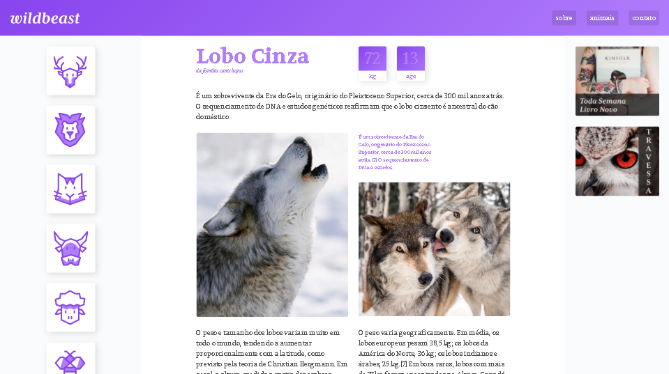

# wildbeast

  

Site feito em um curso da Origamid para me introduzir no uso do grid, já usava bastante flexbox e achava que o grid seria mais complicado, porém depois desse curso 
eu achei algo simples e que facilita o desenvolvimento dos sites assim como o flexbox, e quanto mais eu estudo mais eu vejo o grid sendo usado e vou aprendendo
coisas novas.
